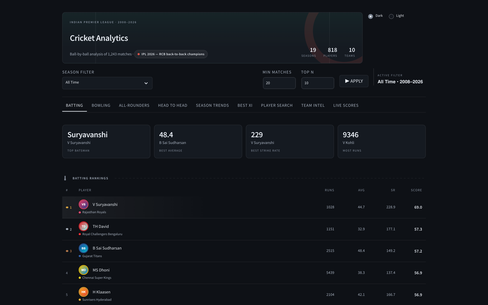
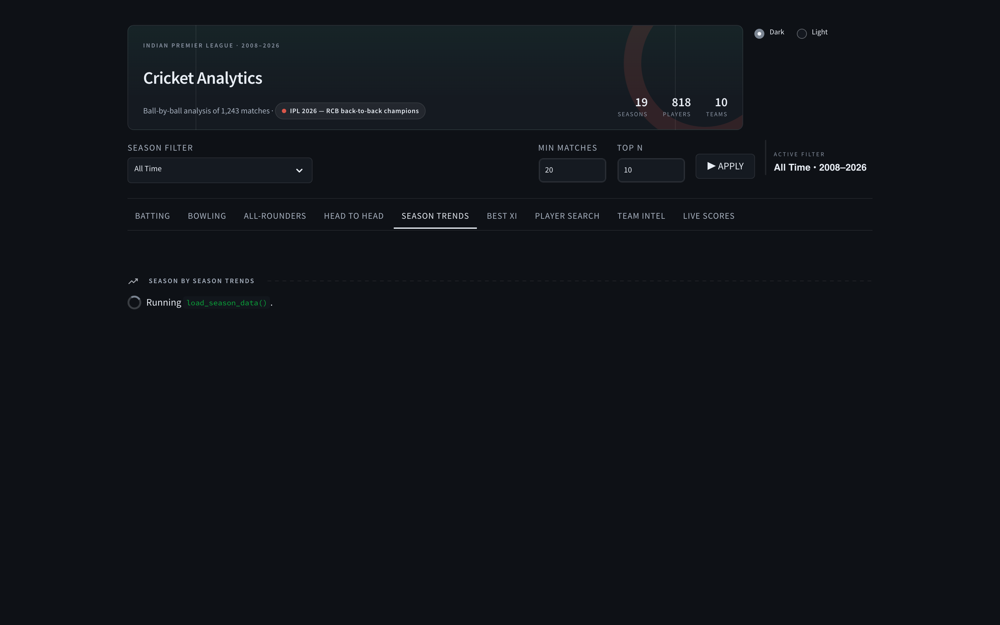
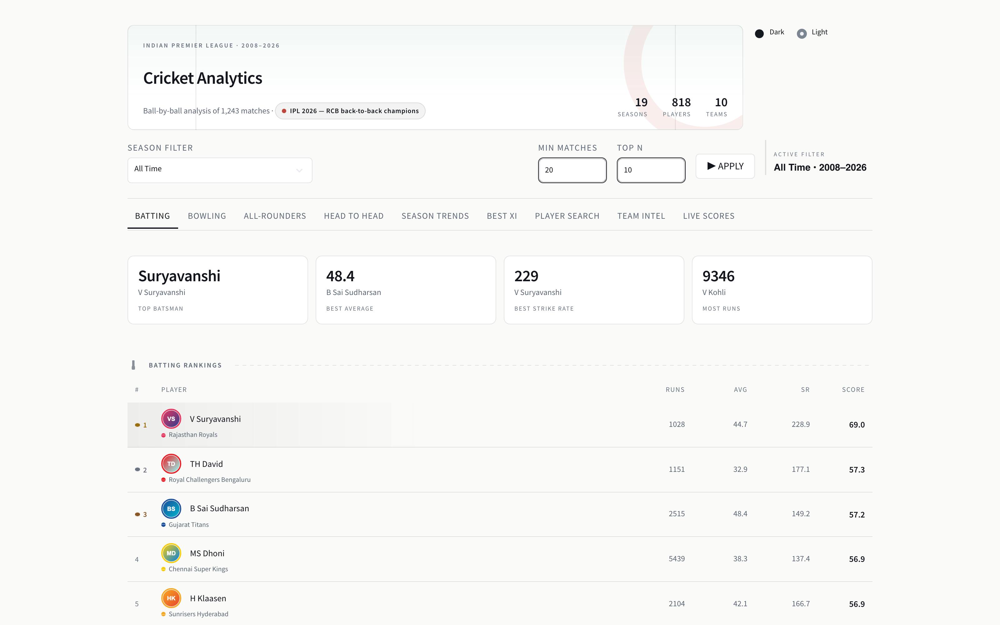

# Cricket Analytics

[](https://github.com/nangareo/cricket-analytics/actions/workflows/ci.yml)
[](LICENSE)

IPL analytics dashboard over Cricsheet ball-by-ball data — 1,243 matches and
~296,000 deliveries, 2008 to 2026. Streamlit front end, pandas scoring
pipeline, Jenkins → Docker Hub → EC2 deploy.



<details>
<summary>More screens</summary>

**Season trends** — scoring across 19 seasons



**Light theme** — the same page, one toggle



</details>

## What was wrong with it

Worth reading if you use Cricsheet data. csv2 writes "no wicket" as a quoted
empty string, and a `line.split(",")` parser hands that back as the string
`'""'` rather than `NA`. `.notna()` is then true on every delivery, so:

| | was | should be |
|---|---|---|
| V Kohli batting average | 0.40 | **40.5** |
| SL Malinga wickets | 534 | **170** |
| Bowling strike rate | 1.00 for all 203 bowlers | a real number |
| Top fielder | B Kumar, a bowler | **MS Dhoni** |

Batting "average" was strike rate ÷ 100. Bowling "wickets" counted balls
bowled. Catches were credited to the bowler because the fielder columns were
never read. One defect, four broken leaderboards — all now covered by tests.

## Quick start

```bash
python3 -m venv .venv
source .venv/bin/activate
pip install -r requirements.txt

streamlit run dashboard/app.py     # http://localhost:8501
```

Docker is **not** needed to run or develop this — it only appears in the deploy
path, where the Jenkins agent builds the image and the EC2 host runs it.

## Layout

| Path | What it does |
|---|---|
| `data/raw/` | 1,243 Cricsheet csv2 match files, seasons 2008–2026 |
| `ingestion/data_loader.py` | The csv2 parser. Single source of truth for every number. |
| `analytics/*/​*_scorer.py` | Batting / bowling / fielding / all-rounder scoring |
| `analytics/*/​*_scores.csv` | Generated rankings — what the dashboard reads |
| `dashboard/app.py` | The Streamlit dashboard (9 tabs) |
| `dashboard/theme.py` | Design tokens — one place defines both themes |
| `analytics/player_teams.csv` | Every player mapped to their current franchise |
| `tests/` | pytest unit tests for the parser and scoring maths |
| `e2e/` | Playwright end-to-end tests against the running dashboard |

## Regenerating the rankings

Run in this order — the all-rounder scorer consumes the other three CSVs:

```bash
python analytics/batting/batting_scorer.py
python analytics/bowling/bowling_scorer.py
python analytics/fielding/fielding_scorer.py
python analytics/allrounder/allrounder_scorer.py
python analytics/player_teams.py          # player -> franchise map
```

## Reading the csv2 format

Cricsheet `ball` rows carry 21 fields. Two are easy to misread, and both have
produced wrong numbers here before:

- **Field 3 (`delivery`)** is a per-over counter that keeps climbing through
  extras, so a single over can run `0.1 … 0.7 … 0.8`.
- **Field 17 (`ball`)** is the real `over.legal_ball`, and repeats when a
  delivery is re-bowled. **Phase filters must use this one.**

"No wicket" is written as a quoted empty string. It must be parsed to `NA` —
if it stays an empty string, `.notna()` is true on every delivery and dismissal
and wicket counts silently become "number of balls bowled".

Fields 19–20 hold the **fielders**, so catches and run outs belong to them, not
to the bowler.

## Design

`dashboard/theme.py` is the only place colour, type and spacing are defined.
It emits CSS custom properties for the markup and hands the same values to
Plotly, which takes its colours in Python — that shared source is what makes
the in-app dark/light toggle work.

Palette choices were validated against the surfaces they actually render on
(`#0E1116` dark, `#FAFAF8` light): every series colour clears the lightness
band, the chroma floor and adjacent-pair colour-vision separation. Light-mode
aqua sits at 2.69:1 — fine for a chart mark that carries a direct label, not
for text, so `accent` and `accent_mark` are separate tokens.

Team colour is information, not decoration: it comes from the resolved
franchise and appears as a dot beside muted label text, never as tinted type.
Tinting the figures put CSK yellow at 1.46:1 on the light ground.

Cricket motifs are drawn in CSS from the same tokens, so they follow the theme:
the header sits on a pitch strip with its creases marked and a ball-seam arc
behind it, section rules are seam stitching, the top three ranks carry a seamed
ball, and each team dot has a seam across the middle.

### Chart colour

Drawn from cricket's own materials rather than a generic chart palette:

| | |
|---|---|
| **Willow** (amber) | batting charts — the bat |
| **Leather** (red) | bowling charts — the ball |
| **Indigo** (blazer blue) | Best XI, the composition donut, the middle series slot |
| **Turf** (green) | Season Trends only — the ground over time |

Each tab reads as its own material, and that is measured: every pair of tabs is
at least ΔE 15 apart in OKLab. Sightscreen sky was tried for Best XI first and
dropped — it sat 13.2-15.0 from turf in dark and **9.3** in light, so Season
Trends and Best XI were hard to tell apart. A neutral slate was no better
(10.9 from turf in light). Indigo clears every other material by 19-25.

**The interface itself carries no hue.** Active states are weight and ink, not
colour, so the only colour on screen is the team dots and the charts. Green is
reserved for grass: the Season Trends charts and the faint pitch wash behind
the header. Nothing else is green, and a test enforces that.

The categorical order is **willow → indigo → leather**, keeping amber and red
non-adjacent: that pair measures ΔE 13.9 to normal vision, under the 15 floor.
Three slots is the cap, so the all-rounder radar shows the top 3 rather than
cycling five players through three colours, and the Best XI donut uses ordinal
shades of one hue because its four slices are directly labelled.

### Season Trends

A trend over time is a line, so the two trends are lines. They previously drew
bars on a time axis, coloured each bar by its own value — which double-encodes
bar length as hue and burns the only free channel on information the chart
already shows — and printed a number above all nineteen. Labels now ride the
first, last and peak points; the table underneath carries every value. The one
remaining bar chart (matches per season) is context, so it takes a single flat
colour and a true zero baseline.

Its numbers were wrong too. "Average team score" divided runs by *matches*,
counting both sides together, and left extras out entirely — putting the figure
at roughly twice a real T20 total. It is now runs (including extras) per
innings, excluding super overs, which reproduces the published record: 2009 in
South Africa is the low point at 7.48 an over, 2024 the highest-scoring season
at 9.56.

Sequential ranges are compressed on purpose. The bars are *discrete ordered
marks*, one per player, so the ordinal rule applies — every step has to clear
2:1 against the surface. The full range ran the quiet end down to **1.19:1**,
which left the shortest bars all but invisible.

**Contrast is tested, not eyeballed.** End-to-end tests walk every visible text
node in both themes (nothing below 3:1) and every chart bar in both themes
(nothing below 2:1). Light mode originally shipped 30 text failures.

## Team attribution

Players are mapped to franchises from the deliveries themselves, not a
hand-maintained list. `batting_team` covers batters; bowlers and fielders
belong to the other side in the match, which comes from the `info,team` rows
(needed for abandoned matches, where only one team ever bats). A player is
shown with the franchise they most recently played for, and renamed
franchises report under their current name.

## Live scores

The Live Scores tab needs a free [cricketdata.org](https://cricketdata.org) key.
It is never hardcoded:

```bash
cp .streamlit/secrets.toml.example .streamlit/secrets.toml   # then edit
# or:
export CRICAPI_KEY=your-key
```

In Jenkins it is injected from the `cricapi-key` credential at deploy time.

## Cost

Everything is free and open source, and the dashboard runs fully offline.

| | |
|---|---|
| streamlit | Apache 2.0 |
| pandas · numpy · altair | BSD |
| plotly · tabulate · pytest · Playwright | MIT |
| pyarrow | Apache 2.0 |
| Ball-by-ball data | [Cricsheet](https://cricsheet.org) — free to download; see Cricsheet for its terms |
| Fonts | System sans. No webfont CDN, so no third-party request |
| Streamlit telemetry | Off (`gatherUsageStats = false`) — it posted to api.segment.io on every load |

An end-to-end test asserts the page makes **zero** third-party requests.

The one optional paid-tier service is [cricketdata.org](https://cricketdata.org)
for the Live Scores tab: the free tier allows 100 requests/day, and responses
are cached for 60s. Every other tab works without it — no key, no network.

Deployment uses Docker Hub and Jenkins, both free for this scale.

## Tests

```bash
pytest                       # parser + scoring maths
npx playwright test          # end-to-end, boots the dashboard itself
npx playwright show-report   # after an e2e run
```

First-time Playwright setup:

```bash
npm install
npx playwright install chromium
```

## Deploy

`Jenkinsfile` runs: build → smoke test + unit tests → push to Docker Hub →
deploy container → verify → prune.
